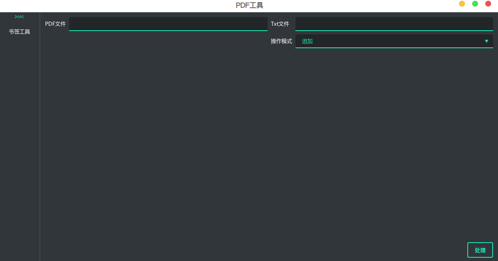

# PDF

## 书签工具



1. 支持txt文件导入书签
2. 支持4级目录添加
3. 追加书签和覆盖书签两种模式

### 书签txt格式

```
第一篇@11
    目录@12
    引言@13
    1. 误差@13
        1.1 误差的类型与来源@13
        1.2 误差的一些基本概念@14
        1.3 误差分析@15
            1.3.1 基本算术运算结果的误差界@15
            1.3.2 函数求值的误差估计@16
```
- 书签的嵌套是靠tab或者4个空格来区别
- `@`后面为页号

## 分割工具

1. 支持自定义页码分割
    ```
    1,3,5-6,7-18,19-32
    ```

# 打包

windows
```
pyinstaller -F -w --upx-exclude=vcruntime140.dll main.py
```
linux
```
pyinstaller -F -w main.py
```
修改 main.spec 中的
```
excludes=["numpy", "scipy", "opencv", "PySide6", "chardet"],
```
再次执行
```
pyinstaller main.spec
```
